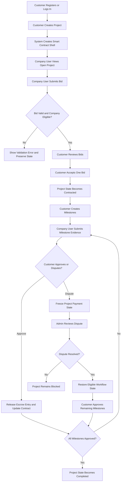
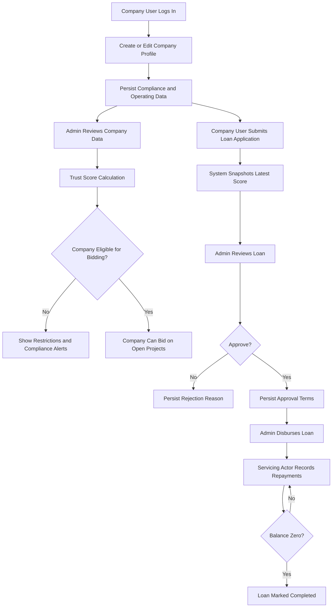

# DecoFinance Operation Workflow and Testing

## 1. Purpose

This document defines the operational Definition of Done for the current DecoFinance application by analyzing the implemented role model, route protection, business workflows, and automated test surface.

The objective is not to invent new product scope. It is to determine what the system must reliably do, based on the current codebase, for the platform to be considered operationally complete.

## 2. Scope and Role Interpretation

The requested role model for this document is:

- Customer
- Company User
- Admin

The current codebase also contains a `reviewer` role for dispute resolution, loan review, and audit visibility. For Definition of Done purposes, the reviewer responsibilities should be treated as one of the following:

- an internal specialization of Admin; or
- a deployment variant of the Admin governance function.

If the deployment truly exposes only the three requested roles, then every reviewer-only workflow must either be reassigned to Admin or treated as an internal alias of Admin in deployment and documentation.

## 3. Definition of Done Summary

The system is done only when all of the following are true:

- each role can complete its mandatory tasks from login to outcome without manual database intervention;
- every workflow persists the expected state changes in the database;
- every sensitive workflow is protected by authentication, role checks, and ownership checks;
- every cross-role workflow has a clear handoff and no dead-end state;
- every critical state transition is covered by automated backend and UI tests;
- failure cases return a safe user-facing response and do not leave invalid partial state;
- governance actions produce traceable audit records.

## 4. Phase 1: Role-Based Task Analysis

### 4.1 Roles vs Required Capabilities Matrix

| Role | Required Capability | Why This Capability Is Necessary | Current System Basis |
|------|------|------|------|
| Customer | Register and log in | The user cannot access protected workflows without an identity and session | Auth routes and session-based access guards |
| Customer | Browse company list and company details | The customer must be able to discover candidate service providers before starting execution workflows | Company list, detail, score report, and PDF report routes |
| Customer | Create and edit owned projects | The customer is the system actor that initiates project demand and defines scope | Project create and edit routes |
| Customer | View owned projects and accepted contract state | The customer must inspect active work, bids, milestones, disputes, and contract state to manage execution | Project detail route and contract state rendering |
| Customer | Accept one bid for an owned project | The platform requires a single contractor selection to move from bidding into contracted execution | Bid acceptance logic and project state machine |
| Customer | Create milestones for a contracted project | The payment and release workflow is milestone-driven, so the customer must define staged approval checkpoints | Milestone creation route and escrow planned entries |
| Customer | Approve submitted milestones | Milestone approval is the customer-controlled release trigger in the current application model | Milestone approval route and release ledger logic |
| Customer | Raise disputes on owned projects or milestones | The customer needs a formal mechanism to stop progress acceptance when quality or scope is contested | Dispute creation route and freeze logic |
| Customer | Inspect dispute history relevant to owned projects | The user must be able to understand whether project execution is blocked and why | Dispute list filtering by project ownership |
| Company User | Register and log in | The company actor cannot maintain a profile or participate in work without an authenticated identity | Auth routes and role checks |
| Company User | Create and maintain a company profile | The company must publish operational and compliance data before bidding and financing workflows make sense | Company create and edit routes |
| Company User | View company trust and compliance outputs | The company needs visibility into score and compliance posture to correct issues and support financing or bidding eligibility | Company detail and report routes |
| Company User | Submit bids to open projects | Bidding is the primary company-side participation mechanism in the project workflow | Bid submission route |
| Company User | View accessible projects | The company must see either open opportunities or the projects where it already participates | Project list and project access rules |
| Company User | Submit milestone evidence for awarded work | After bid acceptance, the company must be able to claim progress and move the work into customer review | Milestone submission route |
| Company User | Raise disputes on participating projects | A company needs a controlled channel to challenge blocked execution, milestone disagreement, or project-level issues | Dispute creation route with company participation checks |
| Company User | Submit loan applications | Financing is part of the current implemented domain and is materially linked to company trust and project activity | Loan application routes and project linkage |
| Company User | Track loan status and repayment state | Once a financing workflow exists, the applicant must be able to monitor and service the obligation | Loan list, detail, and repayment routes |
| Admin | Log in with elevated access | Governance workflows require privileged entry points | Role-aware route protection |
| Admin | View platform dashboard and portfolio risk state | The system is not operationally governed unless an administrator can observe system health, backlog, disputes, and concentration risk | Dashboard and stats endpoints |
| Admin | Create, edit, and delete company records where necessary | Admin must be able to repair or oversee company records and verification posture | Company create, edit, and delete routes |
| Admin | Review trust and compliance data | Admin is responsible for ensuring company participation rules are defensible and traceable | Company reports, score calculation, comparison view |
| Admin | Review, approve, reject, disburse, and delete loan applications | Financing workflows require a governance actor to move applications through controlled states | Loan review, disbursement, and delete routes |
| Admin | Resolve disputes | Project execution can deadlock without an authority that can close dispute states | Dispute resolution route |
| Admin | View audit logs | Sensitive state changes must be reviewable to support QA, operations, and compliance review | Audit log route |
| Admin | Access all projects and operational records | Administrative intervention requires complete visibility across user-owned entities | Project and dispute visibility rules |

### 4.2 Role-Based Definition of Done

The system is not done if any role lacks one of the mandatory capabilities above, or if that capability exists without adequate authorization, persistence, or test coverage.

## 5. Phase 2: Operational Workflow Design

### 5.1 Workflow A: Identity and Session Establishment

| Step | Frontend Interaction | Backend Processing | Data Persistence | Failure and Edge Handling |
|------|------|------|------|------|
| 1 | User opens registration form | Render registration template | None | Page must load without authentication |
| 2 | User submits username, email, password, and role | Validate uniqueness, hash password, create user, emit audit event | `users`, `audit_logs` | Duplicate username or email must reject cleanly without partial user creation |
| 3 | User opens login form and submits credentials | Validate password, reject inactive accounts, create session, emit audit event | Session store, `audit_logs` | Invalid credentials must not create a session; inactive users must be blocked |
| 4 | User logs out | Remove session and emit audit event | Session store, `audit_logs` | Logout must be safe even if session is already missing |

### 5.2 Workflow B: Company Profile and Trust Maintenance

| Step | Frontend Interaction | Backend Processing | Data Persistence | Failure and Edge Handling |
|------|------|------|------|------|
| 1 | Company User or Admin opens company creation form | Render form with current defaults | None | Route must reject unauthorized roles |
| 2 | User submits company data | Parse form, validate values, create company, link company user if needed, emit audit event | `companies`, optional `users.company_id`, `audit_logs` | Invalid payload must roll back and preserve prior user linkage |
| 3 | Company User or Admin edits company profile | Load record, enforce management permission, update compliance and operating fields, recalculate bid eligibility flags, emit audit event | `companies`, `audit_logs` | Unauthorized edits must return `403`; invalid updates must not partially commit |
| 4 | Authorized actor recalculates trust score | Execute scoring service, persist score record, cache trust fields on company, emit audit event | `credit_scores`, `companies`, `audit_logs` | Score calculation failure must not create partial score rows |
| 5 | User views company detail or report | Load company, latest score, report context, compliance alerts | Read-only | Missing scores must degrade gracefully with informative UI state |

### 5.3 Workflow C: Project Procurement and Execution

| Step | Frontend Interaction | Backend Processing | Data Persistence | Failure and Edge Handling |
|------|------|------|------|------|
| 1 | Customer opens project creation form | Render form | None | Unauthorized roles must be redirected |
| 2 | Customer submits project | Create project, initialize contract shell, emit audit event | `projects`, `smart_contract_agreements`, `audit_logs` | Invalid input must fail atomically |
| 3 | Company User opens project list/detail | Filter project visibility by open bidding or company participation | Read-only | Unauthorized access must return `403` or filtered results |
| 4 | Company User submits bid | Confirm project is open, confirm company is eligible, prevent duplicate active bid, create bid, emit audit event | `project_bids`, `audit_logs` | Closed project, unverified company, or duplicate bid must be rejected without creating records |
| 5 | Customer accepts one bid | Enforce project ownership, confirm same-project bid, confirm no competing accepted bid, update bid and project states, update smart contract, emit audit event | `project_bids`, `projects`, `smart_contract_agreements`, `audit_logs` | Invalid bid reference or already-contracted project must be rejected safely |
| 6 | Customer creates milestone | Require contracted or in-progress project, create milestone, create planned escrow entry, update smart contract counters, emit audit event | `project_milestones`, `escrow_ledger_entries`, `smart_contract_agreements`, `audit_logs` | Milestone creation on open project must be blocked |
| 7 | Awarded Company User submits milestone evidence | Confirm awarded company identity, confirm valid project state, confirm milestone is still planned, transition milestone and project state, update smart contract, emit audit event | `project_milestones`, `projects`, `smart_contract_agreements`, `audit_logs` | Unawarded company submission must return `403`; repeat submission must be blocked |
| 8 | Customer approves milestone | Enforce ownership, require submitted state, block approval if disputes remain open, release escrow entry, update project and smart contract state, emit audit event | `project_milestones`, `escrow_ledger_entries`, `projects`, `smart_contract_agreements`, `audit_logs` | Approval must fail if milestone is disputed or not submitted |

### 5.4 Workflow D: Dispute and Recovery Control

| Step | Frontend Interaction | Backend Processing | Data Persistence | Failure and Edge Handling |
|------|------|------|------|------|
| 1 | Customer or Company User opens dispute from project detail | Validate project access and optional milestone linkage | Read-only validation | Unrelated company access must be blocked |
| 2 | Actor submits dispute form | Create dispute case, mark project or milestone disputed, freeze releasable ledger states, update smart contract, emit audit event | `dispute_cases`, `projects`, `project_milestones`, `escrow_ledger_entries`, `smart_contract_agreements`, `audit_logs` | Invalid milestone-to-project pairing must fail; no partial freeze state should remain on rollback |
| 3 | Admin reviews dispute list | Filter disputes by privileged access | Read-only | If only three roles exist, Admin must own this workflow operationally |
| 4 | Admin resolves dispute | Set resolved state, attach resolution summary, restore project and milestone status where appropriate, update smart contract, emit audit event | `dispute_cases`, `projects`, `project_milestones`, `smart_contract_agreements`, `audit_logs` | Re-resolving an already resolved dispute should be idempotent at the UX level |

### 5.5 Workflow E: Loan Application and Servicing

| Step | Frontend Interaction | Backend Processing | Data Persistence | Failure and Edge Handling |
|------|------|------|------|------|
| 1 | Company User opens loan application form | Load only the actor's active company and only projects where that company is the awarded contractor | Read-only | Unauthorized roles must be redirected away from the workflow |
| 2 | Applicant submits loan application | Validate company ownership, validate optional project linkage against awarded participation, snapshot latest score, create application, emit audit event | `loan_applications`, `audit_logs` | Unknown company, invalid amounts, or invalid project linkage must fail without partial persistence |
| 3 | Admin opens review screen | Load loan application and context | Read-only | Unauthorized access must be blocked |
| 4 | Admin approves or rejects application | Set decision fields, reviewer identity, conditions or rejection reason, emit audit event | `loan_applications`, `audit_logs` | Invalid action values must not create partial decisions |
| 5 | Admin disburses approved loan | Confirm approved state, populate disbursement and repayment schedule fields, emit audit event | `loan_applications`, `audit_logs` | Disbursement before approval must be blocked |
| 6 | Authorized servicing actor records repayment | Apply payment, prevent overpayment, close loan if balance reaches zero, emit audit event | `loan_applications`, `audit_logs` | Overpayment and repayment on completed loans must be rejected cleanly |

### 5.6 Workflow F: Governance and Operational Oversight

| Step | Frontend Interaction | Backend Processing | Data Persistence | Failure and Edge Handling |
|------|------|------|------|------|
| 1 | Admin opens dashboard | Aggregate score, loan, dispute, and company monitoring data | Read-only aggregation | Page must tolerate empty datasets |
| 2 | Admin opens company comparison or report views | Build report context and PDF exports | Read-only or file generation | Missing score history must not break report rendering |
| 3 | Admin opens audit logs | Load recent audit events | Read-only | Unauthorized access must redirect safely |
| 4 | Admin uses JSON inspection endpoints | Enforce role-sensitive access to portfolio inspection APIs | Read-only | Unauthenticated requests must return `401`; forbidden access must return `403` |

## 6. Mermaid Workflow Diagrams

### 6.1 Customer to Company to Admin Main Flow



### 6.2 Company Trust and Financing Flow



## 7. Phase 3: Automated Verification Strategy

### 7.1 Primary Tooling

The recommended tooling should align with the current repository rather than replace it.

| Layer | Tool | Reason |
|------|------|------|
| Backend unit and route tests | `pytest` | Already used across the repository and suitable for fast deterministic coverage |
| HTTP and session integration | Flask test client under `pytest` | Best fit for role checks, redirects, form posts, and database assertions |
| Browser workflow verification | `Selenium` | Already present and adequate for end-to-end UI regression on server-rendered templates |
| Database assertions | SQLAlchemy session queries in tests | Required to prove state transitions, not just response codes |
| Optional future enhancement | Playwright | Better DX for UI testing, but not necessary for current Definition of Done |

### 7.2 Test Pyramid

- service and model tests for state transitions and calculations;
- route tests for authorization, redirects, form handling, and persistence;
- end-to-end UI tests for cross-role workflows that depend on rendered templates and browser interaction;
- contract-style JSON API tests for authenticated inspection endpoints.

### 7.3 Required Coverage by Workflow

#### A. Identity and Session

Positive path:

- customer can register with valid credentials;
- company user can log in and receive a session;
- admin can log in and access privileged pages.

Negative path:

- duplicate username or email is rejected;
- inactive user cannot log in;
- unauthenticated access to protected routes redirects or returns `401` for API.

Integration proof:

- login state affects navbar and page access consistently across pages.

#### B. Company Profile and Trust

Positive path:

- company user creates a company and becomes linked to it when unlinked;
- authorized actor updates company verification fields;
- trust score calculation creates a score record and updates cached fields;
- company report and PDF endpoint load successfully.

Negative path:

- unauthorized user cannot edit another company;
- invalid company payload rolls back cleanly;
- ineligible company cannot bid.

Integration proof:

- compliance warnings shown in UI match persisted compliance state.

#### C. Project Procurement and Execution

Positive path:

- customer creates project;
- company user submits bid to open project;
- customer accepts exactly one bid;
- customer creates milestones after contract award;
- awarded company submits milestone evidence;
- customer approves milestone and escrow release is recorded;
- final milestone completion closes project.

Negative path:

- non-owner customer cannot edit or approve another project;
- duplicate active bid from same company is blocked;
- milestone creation before contract award is blocked;
- non-awarded company cannot submit milestone;
- open dispute blocks milestone approval.

Integration proof:

- project detail page shows status progression, contract state, and recent event history after each action.

#### D. Dispute Control

Positive path:

- customer opens project-level dispute;
- company user opens dispute only on a participating project;
- admin resolves dispute with summary;
- project and milestone states recover to a valid post-resolution state.

Negative path:

- unrelated company cannot open dispute;
- mismatched milestone-to-project reference is rejected;
- already resolved dispute cannot be resolved again in a destructive way.

Integration proof:

- UI shows frozen workflow behavior until dispute resolution occurs.

#### E. Loan Workflow

Positive path:

- applicant creates loan application with optional project reference;
- company applicant can only link the loan to a project where it is the awarded contractor;
- admin approves or rejects with traceable decision fields;
- approved loan can be disbursed;
- repayment reduces balance and eventually closes the loan.

Negative path:

- invalid company reference is rejected;
- unauthorized roles cannot open the loan application form;
- a company user cannot submit a loan for another company;
- a company user cannot link a loan to a project where it was not awarded the work;
- disbursement before approval is blocked;
- overpayment is blocked;
- completed loan cannot be repaid again.

Integration proof:

- loan detail screen reflects review, disbursement, and repayment state changes after each action.

#### F. Governance and Audit

Positive path:

- admin dashboard loads with aggregated metrics;
- admin audit log view loads recent governance events;
- admin-only API endpoints return data for authorized sessions.

Negative path:

- non-admin users cannot access privileged admin pages;
- unauthenticated API requests are rejected;
- forbidden API requests return `403`.

Integration proof:

- audit records exist after project creation, bid acceptance, milestone approval, dispute creation and resolution, and loan review.

### 7.4 Example Backend Test Snippets

```python
import pytest

from app import create_app
from models.database import db
from models.project import Project
from models.project_bid import ProjectBid
from models.project_milestone import ProjectMilestone
from models.escrow_ledger_entry import EscrowLedgerEntry


def login_as(client, user_id):
    with client.session_transaction() as session:
        session["user_id"] = user_id


def test_customer_can_only_accept_one_bid(client):
    login_as(client, customer_id)

    response = client.post(f"/projects/{project_id}/bids/{first_bid_id}/accept")
    assert response.status_code == 302

    response = client.post(f"/projects/{project_id}/bids/{second_bid_id}/accept")
    assert response.status_code == 302

    with client.application.app_context():
        project = db.session.get(Project, project_id)
        bids = ProjectBid.query.filter_by(project_id=project_id).all()
        assert project.accepted_bid_id == first_bid_id
        assert sum(1 for bid in bids if bid.status == "accepted") == 1


def test_open_dispute_blocks_milestone_approval(client):
    login_as(client, customer_id)

    response = client.post(f"/projects/milestones/{milestone_id}/approve")
    assert response.status_code == 302

    with client.application.app_context():
        milestone = db.session.get(ProjectMilestone, milestone_id)
        released = EscrowLedgerEntry.query.filter_by(
            project_id=project_id,
            milestone_id=milestone_id,
            entry_type="released",
        ).count()
        assert milestone.status == "submitted"
        assert released == 0
```

```python
def test_api_contract_requires_authenticated_project_access(client):
    response = client.get(f"/api/projects/{project_id}/contract")
    assert response.status_code == 401

    login_as(client, unrelated_company_user_id)
    response = client.get(f"/api/projects/{project_id}/contract")
    assert response.status_code == 403
```

### 7.5 Example UI Test Snippets

```python
from selenium.webdriver.common.by import By
from selenium.webdriver.support.ui import WebDriverWait
from selenium.webdriver.support import expected_conditions as EC


def test_customer_creates_project_and_company_bids(driver, live_server):
    wait = WebDriverWait(driver, 10)

    login(driver, live_server, "customer_ui", "password123")
    driver.get(f"{live_server}/projects/add")
    driver.find_element(By.ID, "title").send_keys("Workflow Project")
    driver.find_element(By.ID, "budget_amount").send_keys("300000")
    driver.find_element(By.CSS_SELECTOR, "button[type='submit']").click()
    wait.until(EC.text_to_be_present_in_element((By.TAG_NAME, "body"), "Workflow Project"))
    logout(driver)

    login(driver, live_server, "builder_ui", "password123")
    driver.get(f"{live_server}/projects/")
    driver.find_element(By.LINK_TEXT, "View").click()
    driver.find_element(By.NAME, "bid_amount").send_keys("285000")
    driver.find_element(By.CSS_SELECTOR, "form[action$='/bids'] button[type='submit']").click()
    wait.until(EC.text_to_be_present_in_element((By.TAG_NAME, "body"), "Bid submitted successfully"))
```

```python
def test_admin_can_resolve_dispute_and_view_audit(driver, live_server):
    wait = WebDriverWait(driver, 10)

    login(driver, live_server, "admin_ui", "password123")
    driver.get(f"{live_server}/disputes/")
    driver.find_element(By.CSS_SELECTOR, "form[action*='/resolve'] button").click()
    wait.until(EC.text_to_be_present_in_element((By.TAG_NAME, "body"), "Dispute resolved"))

    driver.get(f"{live_server}/admin/audit-logs")
    wait.until(EC.text_to_be_present_in_element((By.TAG_NAME, "body"), "dispute_resolved"))
```

### 7.6 Completion Criteria for Automated Verification

Passing the defined test suite signifies the following:

- the three requested roles can complete their mandatory workflows;
- protected routes and APIs reject unauthorized or unauthenticated access;
- core state machines for project, milestone, dispute, and loan flows are functioning;
- UI behavior reflects the underlying persisted state rather than stale assumptions;
- auditability exists for sensitive actions;
- the application is operationally consistent for the currently implemented scope.

Passing tests does not signify that future-state integrations such as external document storage, bank APIs, or third-party compliance APIs are complete.

## 8. Phase 4: Gap Analysis and Self-Review

### 8.1 Missing Links Where a User May Get Stuck

- If the deployment uses only Customer, Company User, and Admin, the current reviewer-only screens still create a governance dependency. Admin must be authorized to perform all reviewer actions or the deployment policy must map reviewer capability into the admin operating model.
- There is no explicit user administration workflow for role reassignment, account activation, or secure elevation. The data model supports inactive users, but the operational UI for managing them is not present.
- The dispute workflow is one-sided after opening and resolution. There is no implemented structured response workflow for the opposing party.

### 8.2 Security and Authorization Check

The following fixes have been applied and verified:

- **[RESOLVED]** Public self-registration is limited to `customer` and `company_user` roles via `SELF_REGISTRATION_ROLES` whitelist in `routes/auth.py`. Privileged roles (`admin`, `reviewer`) cannot be self-registered. The registration form template only displays allowed roles.
- **[RESOLVED]** Loan creation is restricted to `company_user` only. The loan form only shows the actor's own company. Project linkage validates that the company holds the `accepted_bid_id` on the project, not just any bid.
- **[RESOLVED]** Loan list view is company-scoped for `company_user` actors. Loan detail, repayment, and review routes enforce ownership via `_can_access_loan()` helper. `HTTPException` is properly re-raised in try/except blocks to prevent swallowing 403 aborts.
- **[RESOLVED]** Navbar loan link is wrapped in a role check (`company_user`, `admin`, `reviewer`), preventing the redirect loop where unauthorized users repeatedly bounced between the loan page and the home page.
- **[RESOLVED]** Loan review, disbursement, and deletion are restricted to `reviewer` and `admin` roles.

Remaining observations:

- Privileged user lifecycle management (create, deactivate, reassign roles) is still missing — admin/reviewer accounts must be seeded or created via database.
- The trust score recalculation route still allows any authenticated user to trigger score recalculation on any company record. That is likely too permissive for a final role-secure design.
- Company details and report visibility are broad for authenticated users. This may be acceptable for an open marketplace, but it should be explicitly treated as policy rather than accidental exposure.

### 8.3 Critical Functions That Appear Missing

- Secure administrative user lifecycle management:
  create, deactivate, and reassign roles without direct database access.
- Bilateral dispute collaboration:
  allow the non-opening party to attach structured evidence or notes before resolution.
- Explicit operational mapping between Admin and Reviewer:
  either consolidate the roles or formally document them as distinct in all requirement and QA assets.
- Privileged user administration:
  add a managed workflow for creating, deactivating, and assigning privileged accounts without direct database edits.

## 9. Recommended Definition of Done Gate

The release should be accepted only if all gates below pass:

- Functional gate:
  all mandatory role capabilities are demonstrated end-to-end.
- Authorization gate:
  unauthorized access attempts fail safely across web and API surfaces.
- Persistence gate:
  each workflow produces the correct durable state changes.
- Audit gate:
  sensitive actions generate audit records that can be reviewed by Admin.
- Recovery gate:
  failure and dispute states can be exited through a defined authorized workflow.
- Automation gate:
  backend and UI regression suites pass in CI without manual data repair.

## 10. Automated Test Results

As of 2026-03-12, the full test suite passes with zero failures:

```
49 passed in 66.32s
```

| Test File | Tests | Status |
|-----------|-------|--------|
| `tests/frontend/test_ui_selenium.py` | 3 | All passed |
| `tests/test_auth_roles.py` | 3 | All passed |
| `tests/test_loans_authorization.py` | 9 | All passed |
| `tests/test_projects.py` | 9 | All passed |
| `tests/test_routes.py` | 5 | All passed |
| `tests/test_routes_simple.py` | 18 | All passed |
| `tests/test_system.py` | 1 | All passed |

Key authorization tests:

- `test_register_rejects_privileged_roles` — confirms admin/reviewer self-registration is blocked
- `test_customer_cannot_access_loan_workspace` — confirms customer role is redirected away from loans
- `test_company_user_cannot_apply_for_other_company` — confirms cross-company loan creation returns 403
- `test_company_user_can_apply_for_owned_company` — confirms valid loan creation with awarded project link succeeds
- `test_company_user_cannot_link_loan_to_unawarded_project` — confirms project linkage requires accepted bid
- `test_admin_can_view_all_loans` — confirms admin has full loan visibility

## 11. Final Assessment

DecoFinance has achieved an operationally coherent role-based platform for the requested three-role model. The critical authorization and governance gaps previously identified have been resolved:

- Self-registration is restricted to end-user roles.
- Loan workflows enforce company ownership, role-based access, and valid project linkage.
- Navigation is role-aware, eliminating redirect loops for unauthorized roles.
- All 49 automated tests pass, covering authentication, authorization, project lifecycle, loan workflows, disputes, and UI end-to-end flows.

Remaining items for future hardening:

- Privileged user lifecycle management (admin panel for creating/deactivating users).
- Trust score recalculation access tightening.
- Bilateral dispute collaboration workflow.
- Explicit Admin/Reviewer role consolidation or formal documentation as distinct roles.

With the current automated verification strategy enforced in CI, the application is operationally complete for the currently implemented scope.