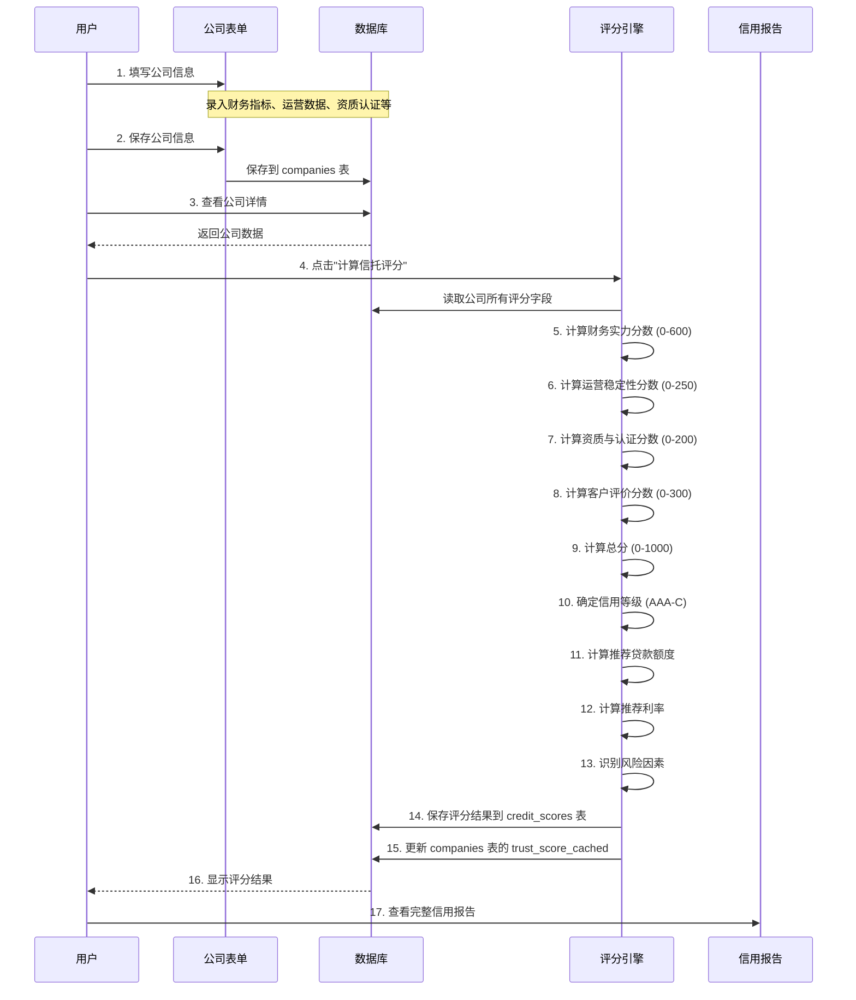

# 公司最新评分体系数据来源说明

## 概述

DecoFinance 采用新的 **4 维度信托评分体系**（2026 年 3 月更新），所有评分数据均来自公司表单录入。本说明文档详细介绍了评分体系的数据来源、录入路径和计算逻辑。

---

## 评分体系概览

| 维度 | 权重 | 最高分 | 评分内容 |
|------|------|--------|---------|
| **财务实力** | 60% | 600 分 | 注册资本、年营业额、流动比率、现金比率、债务权益比 |
| **运营稳定性** | 25% | 250 分 | 成立年限、完成项目数、员工人数 |
| **资质与认证** | 15% | 200 分 | 商业登记、小型工程注册、保险状态、OSH 安全主任、ISO 认证 |
| **客户评价** | - | 300 分 | 客户评分平均值、DecoFinance 主观评估 |

**总分范围**：0 - 1000 分  
**信用等级**：AAA (751-1000), AA (701-750), A (651-700), BBB (601-650), BB (551-600), B (501-550), C (0-500)

---

## 数据来源详解

### 1️⃣ 财务实力 (Financial Strength) - 最高 600 分

#### 评分指标

| 指标 | 权重 | 最高分 | 数据来源字段 | 录入位置 |
|------|------|--------|------------|---------|
| 注册资本 | 25% | 150 分 | `registered_capital` | 公司表单 → 基本信息 |
| 年营业额 | 25% | 150 分 | `annual_revenue` | 公司表单 → 基本信息 |
| 流动比率 | 25% | 150 分 | `current_assets` / `current_liabilities` | 公司表单 → 运营和财务 |
| 现金比率 | 25% | 150 分 | `total_cash` / `total_liabilities` | 公司表单 → 运营和财务 |
| 债务权益比 | 25% | 150 分 | `total_liabilities` / `shareholders_equity` | 公司表单 → 运营和财务 |

#### 录入入口

**路径**：`/companies/add` 或 `/companies/<id>/edit`

**表单位置**：第 2 部分 "运营和财务"

**字段说明**：

```
┌─────────────────────────────────────────────────────────────┐
│ 运营和财务                                                   │
├─────────────────────────────────────────────────────────────┤
│ • 流动资产 (current_assets)                                 │
│   - 说明：公司短期内可变现的资产总额                         │
│   - 单位：港币 (HKD)                                         │
│   - 示例：5,000,000                                          │
│                                                             │
│ • 流动负债 (current_liabilities)                            │
│   - 说明：公司短期内需偿还的债务总额                         │
│   - 单位：港币 (HKD)                                         │
│   - 示例：3,000,000                                          │
│                                                             │
│ • 现金总额 (total_cash)                                     │
│   - 说明：公司银行存款和现金等价物总额                       │
│   - 单位：港币 (HKD)                                         │
│   - 示例：2,500,000                                          │
│                                                             │
│ • 总负债 (total_liabilities)                                │
│   - 说明：公司所有债务总额（包括长期和短期）                 │
│   - 单位：港币 (HKD)                                         │
│   - 示例：4,000,000                                          │
│                                                             │
│ • 股东权益 (shareholders_equity)                            │
│   - 说明：公司净资产（资产 - 负债）                          │
│   - 单位：港币 (HKD)                                         │
│   - 示例：6,000,000                                          │
└─────────────────────────────────────────────────────────────┘
```

#### 计算逻辑

```python
# 1. 注册资本评分
if company.registered_capital >= 10,000,000:  score = 150
elif >= 5,000,000:  score = 120
elif >= 1,000,000:  score = 90
elif >= 500,000:    score = 60
else:               score = 30

# 2. 年营业额评分
if company.annual_revenue >= 50,000,000:  score = 150
elif >= 20,000,000:  score = 120
elif >= 10,000,000:  score = 90
elif >= 5,000,000:   score = 60
else:                score = 30

# 3. 流动比率评分
current_ratio = company.current_assets / company.current_liabilities
if current_ratio > 1.6:   score = 150
elif >= 1.1:              score = 100
else:                     score = 50

# 4. 现金比率评分
cash_ratio = company.total_cash / company.total_liabilities
if cash_ratio > 1.6:      score = 150
elif >= 1.1:              score = 100
else:                     score = 50

# 5. 债务权益比评分
debt_to_equity = company.total_liabilities / company.shareholders_equity
if debt_to_equity < 1:    score = 150
elif <= 2:                score = 100
else:                     score = 50
```

---

### 2️⃣ 运营稳定性 (Operational Stability) - 最高 250 分

#### 评分指标

| 指标 | 权重 | 最高分 | 数据来源字段 | 录入位置 |
|------|------|--------|------------|---------|
| 成立年限 | 40% | 100 分 | `established_date` | 公司表单 → 基本信息 |
| 完成项目数 | 40% | 100 分 | `project_count_completed` | 公司表单 → 运营和财务 |
| 员工人数 | 20% | 50 分 | `employee_count` | 公司表单 → 运营和财务 |

#### 录入入口

**路径**：`/companies/add` 或 `/companies/<id>/edit`

**表单位置**：
- 成立日期：第 1 部分 "基本信息"
- 员工人数、完成项目数：第 2 部分 "运营和财务"

**字段说明**：

```
┌─────────────────────────────────────────────────────────────┐
│ 基本信息                                                     │
├─────────────────────────────────────────────────────────────┤
│ • 成立日期 (established_date)                               │
│   - 说明：公司注册成立的日期                                 │
│   - 格式：YYYY-MM-DD                                         │
│   - 示例：2018-05-15                                         │
└─────────────────────────────────────────────────────────────┘

┌─────────────────────────────────────────────────────────────┐
│ 运营和财务                                                   │
├─────────────────────────────────────────────────────────────┤
│ • 员工人数 (employee_count)                                 │
│   - 说明：公司全职员工总数                                   │
│   - 单位：人                                                 │
│   - 示例：25                                                 │
│                                                             │
│ • 完成项目数 (project_count_completed)                      │
│   - 说明：过去 5 年内完成的项目总数                          │
│   - 单位：个                                                 │
│   - 示例：45                                                 │
└─────────────────────────────────────────────────────────────┘
```

#### 计算逻辑

```python
# 1. 成立年限评分
years = (today - established_date).days / 365
if years >= 10:    score = 100
elif >= 5:         score = 80
elif >= 3:         score = 60
elif >= 1:         score = 40
else:              score = 20

# 2. 完成项目数评分
if company.project_count_completed >= 100:  score = 100
elif >= 50:                                score = 80
elif >= 20:                                score = 60
elif >= 10:                                score = 40
else:                                      score = 20

# 3. 员工人数评分
if company.employee_count >= 50:   score = 50
elif >= 20:                        score = 40
elif >= 10:                        score = 30
else:                              score = 20
```

---

### 3️⃣ 资质与认证 (Qualifications) - 最高 200 分

#### 评分指标

| 指标 | 权重 | 最高分 | 数据来源字段 | 录入位置 |
|------|------|--------|------------|---------|
| 商业登记 | 25% | 50 分 | `business_registration` | 公司表单 → 基本信息 |
| 小型工程承建商注册 | 25% | 50 分 | `minor_works_contractor_registration` + `minor_works_registration_verified` | 公司表单 → 合规和验证 |
| 保险状态 | 25% | 50 分 | `insurance_documents_uploaded` + `insurance_verified` | 公司表单 → 合规和验证 |
| OSH 安全主任 | 25% | 50 分 | `osh_safety_officer_license` + `osh_safety_officer_verified` | 公司表单 → 合规和验证 |
| ISO 认证 | 加分 | 0-50 分 | `iso_certified` | 公司表单 → 运营和财务 |

#### 录入入口

**路径**：`/companies/add` 或 `/companies/<id>/edit`

**表单位置**：第 3 部分 "合规和验证"

**字段说明**：

```
┌─────────────────────────────────────────────────────────────┐
│ 合规和验证                                                   │
├─────────────────────────────────────────────────────────────┤
│ • 小型工程承建商注册号 (minor_works_contractor_registration)│
│   - 说明：HK Minor Works Contractor Registration Number     │
│   - 格式：数字或字母组合                                      │
│   - 示例：MW1234567                                          │
│                                                             │
│ • 小型工程注册验证状态 (minor_works_registration_verified)  │
│   - 说明：小型工程注册是否已验证                             │
│   - 选项：待审核 / 已验证 / 已拒绝                           │
│                                                             │
│ • 保险文件上传 (insurance_documents_uploaded)               │
│   - 说明：保险文件是否已上传                                 │
│   - 类型：复选框                                             │
│                                                             │
│ • 保险验证状态 (insurance_verified)                         │
│   - 说明：保险是否已验证                                     │
│   - 选项：待审核 / 已验证 / 已拒绝                           │
│                                                             │
│ • OSH 安全主任执照号 (osh_safety_officer_license)           │
│   - 说明：职业安全健康主任的执照号码                         │
│   - 格式：数字或字母组合                                      │
│   - 示例：OSH-2024-12345                                     │
│                                                             │
│ • OSH 安全主任验证状态 (osh_safety_officer_verified)        │
│   - 说明：OSH 安全主任执照是否已验证                         │
│   - 选项：待审核 / 已验证 / 已拒绝                           │
│                                                             │
│ • ISO 认证 (iso_certified)                                  │
│   - 说明：公司是否持有 ISO 认证                              │
│   - 类型：复选框                                             │
│   - 加分项：持有 ISO 认证额外 +50 分                        │
└─────────────────────────────────────────────────────────────┘
```

#### 计算逻辑

```python
# 1. 商业登记评分（必须项）
if company.business_registration:  score = 50
else:                              score = 0

# 2. 小型工程承建商注册评分（必须项）
if minor_works_contractor_registration AND minor_works_registration_verified:
    score = 50
elif minor_works_contractor_registration:
    score = 25
else:
    score = 0

# 3. 保险状态评分（必须项）
if insurance_documents_uploaded AND insurance_verified:
    score = 50
elif insurance_documents_uploaded:
    score = 25
else:
    score = 0

# 4. OSH 安全主任评分（必须项）
if osh_safety_officer_license AND osh_safety_officer_verified:
    score = 50
elif osh_safety_officer_license:
    score = 25
else:
    score = 0

# 5. ISO 认证评分（加分项）
if iso_certified:
    score = 50
else:
    score = 0
```

---

### 4️⃣ 客户评价 (Customer Reviews) - 最高 300 分

#### 评分指标

| 组件 | 权重 | 最高分 | 数据来源字段 | 状态 |
|------|------|--------|------------|------|
| 客户评分平均值 | 50% | 150 分 | `average_rating` | ⚠️ 待实现 |
| DecoFinance 主观评估 | 50% | 150 分 | 系统自动计算 | ✅ 已实现 |

#### 当前状态

⚠️ **注意**：`average_rating` 字段在 Company 模型中**尚未定义**，需要从项目评价系统集成。

#### 当前评分逻辑

```python
# 1. 客户评分平均值（默认值）
avg_rating = getattr(company, 'average_rating', None)
if avg_rating is not None:
    rating_score = 30 + (avg_rating - 1) * 30  # 1-5 分对应 30-150 分
else:
    rating_score = 30  # 默认值

# 2. DecoFinance 主观评估（基于其他字段的综合评估）
subjective_score = _subjective_assessment(company)  # 0-150 分

# 客户评价总分
customer_review_score = rating_score + subjective_score
```

#### 预期集成方案

```python
# 未来实现（需要项目评价系统支持）

# 1. 从 ProjectReview 模型获取平均评分
average_rating = db.session.query(
    func.avg(ProjectReview.rating)
).filter(
    ProjectReview.company_id == company.id
).scalar()

# 2. 评分映射
if average_rating:
    rating_score = 30 + (average_rating - 1) * 30
    # 1.0 分 → 30 分
    # 3.0 分 → 90 分
    # 5.0 分 → 150 分
else:
    rating_score = 30  # 默认值
```

---

## 数据录入流程

### 步骤 1：添加/编辑公司

**访问路径**：
- 新增公司：`/companies/add`
- 编辑公司：`/companies/<id>/edit`

**表单结构**：

```
┌─────────────────────────────────────────────────────────────┐
│ 公司注册 / 编辑                                              │
├─────────────────────────────────────────────────────────────┤
│ 1. 基本信息                                                  │
│   ├─ 公司名称、英文名称                                       │
│   ├─ 商业登记号                                               │
│   ├─ 成立日期                                                 │
│   ├─ 联系人信息                                               │
│   ├─ 地址、区域                                               │
│   ├─ 注册资本                                                 │
│   └─ 年营业额                                                 │
│                                                             │
│ 2. 运营和财务                                                │
│   ├─ 员工人数                                                 │
│   ├─ 完成项目数                                               │
│   ├─ 平均项目金额                                             │
│   ├─ 银行账户年限                                             │
│   ├─ 现有贷款                                                 │
│   ├─ 还款记录                                                 │
│   ├─ 持有牌照                                                 │
│   ├─ ISO 认证                                                 │
│   └─ 流动资产、流动负债、现金总额等（新增）                  │
│                                                             │
│ 3. 合规和验证                                                │
│   ├─ 牌照信息（类型、号码、类别、到期日）                    │
│   ├─ 保险信息（保险公司、保单号、到期日）                    │
│   ├─ 小型工程承建商注册号（新增）                            │
│   ├─ OSH 安全主任执照号（新增）                              │
│   └─ 专业会员资格                                             │
│                                                             │
│ 4. 职业安全健康及 ESG 管控                                   │
│   ├─ OSH 政策                                                 │
│   ├─ 安全培训覆盖率                                           │
│   ├─ 16kg 搬运管控                                            │
│   ├─ 起重设备                                                 │
│   ├─ 安全事故数                                               │
│   ├─ ESG 政策级别                                             │
│   └─ 绿色材料使用率                                           │
└─────────────────────────────────────────────────────────────┘
```

### 步骤 2：计算评分

**访问路径**：
- 公司详情页面 → "信托评分" 卡片 → "计算信托评分" 按钮
- 路由：`POST /companies/<id>/calculate_score`

**入口位置**：

```
┌─────────────────────────────────────────────────────────────┐
│ 公司详情页 → 右侧边栏                                        │
├─────────────────────────────────────────────────────────────┤
│ ┌─────────────────────────────────────────────────────────┐ │
│ │ 信托评分                                                 │ │
│ ├─────────────────────────────────────────────────────────┤ │
│ │ 信用评分：3468                                           │ │
│ │ 信用等级：B                                              │ │
│ │                                                         │ │
│ │ 风险等级：中等                                           │ │
│ │ 建议额度：HK$ 2,000,000                                  │ │
│ │ 利率：6.5%                                               │ │
│ ├─────────────────────────────────────────────────────────┤ │
│ │ [计算信托评分] ← 点击此按钮                              │ │
│ └─────────────────────────────────────────────────────────┘ │
└─────────────────────────────────────────────────────────────┘
```

---

## 评分计算流程



---

## 数据字段清单

### 公司表中所有评分相关字段

```python
# 基本信息
registered_capital              # 注册资本 (float)
annual_revenue                  # 年营业额 (float)
established_date                # 成立日期 (date)

# 运营和财务
employee_count                  # 员工人数 (int)
project_count_completed         # 完成项目数 (int)
current_assets                  # 流动资产 (float) ⭐ 新增
current_liabilities             # 流动负债 (float) ⭐ 新增
total_cash                      # 现金总额 (float) ⭐ 新增
total_liabilities               # 总负债 (float) ⭐ 新增
shareholders_equity             # 股东权益 (float) ⭐ 新增

# 合规和验证
business_registration           # 商业登记 (string)
minor_works_contractor_registration  # 小型工程承建商注册号 ⭐ 新增
minor_works_registration_verified    # 小型工程注册验证状态 ⭐ 新增
insurance_documents_uploaded    # 保险文件上传 ⭐ 新增
insurance_verified              # 保险验证状态 ⭐ 新增
osh_safety_officer_license      # OSH 安全主任执照号 ⭐ 新增
osh_safety_officer_verified     # OSH 安全主任验证状态 ⭐ 新增
iso_certified                   # ISO 认证 (boolean)

# 职业安全健康及 ESG 管控
safety_training_coverage        # 安全培训覆盖率 (int, %)
heavy_lifting_compliance        # 16kg 搬运管控 (boolean)
lifting_equipment_available     # 起重设备可用 (boolean)
safety_incident_count           # 安全事故数 (int)
esg_policy_level                # ESG 政策级别 (string)
green_material_ratio            # 绿色材料使用率 (int, %)

# 客户评价 ⚠️ 待实现
average_rating                  # 客户评分平均值 ⚠️ 缺失
```

---

## 录入入口总结

| 评分维度 | 录入页面 | 路径 | 必填字段 |
|---------|---------|------|---------|
| **财务实力** | 公司表单 | `/companies/add` → "运营和财务" | 流动资产、流动负债、现金总额、总负债、股东权益 |
| **运营稳定性** | 公司表单 | `/companies/add` → "基本信息" + "运营和财务" | 成立日期、员工人数、完成项目数 |
| **资质与认证** | 公司表单 | `/companies/add` → "合规和验证" | 商业登记、小型工程注册、保险状态、OSH 安全主任 |
| **客户评价** | ⚠️ 待实现 | 需要项目评价系统集成 | `average_rating` 字段 |

---

## 评分计算入口

**公司详情页面** → "信托评分" 卡片 → **"计算信托评分" 按钮**

- 英文版本：`/companies/<id>` → "Calculate Trust Score" 按钮
- 中文版本：`/companies/<id>` → "计算信托评分" 按钮

**路由**：`POST /companies/<id>/calculate_score`

**权限要求**：
- `admin` - 可以计算任何公司的评分
- `reviewer` - 可以计算任何公司的评分
- `company_user` - 可以计算自己公司的评分
- `customer` - 可以计算关联公司的评分

---

## 注意事项

### ⚠️ 重要提示

1. **客户评价字段缺失**
   - `average_rating` 字段尚未在 Company 模型中定义
   - 当前使用默认值 30 分
   - 需要从项目评价系统集成

2. **数据完整性**
   - 确保在计算评分前，所有必要的财务和资质数据都已录入
   - 缺失关键字段会导致评分不准确

3. **手动触发**
   - 评分需要手动点击"计算信托评分"按钮
   - 不会自动计算

4. **评分缓存**
   - 评分结果保存在 `credit_scores` 表
   - 公司表中的 `trust_score_cached` 字段存储最新评分

5. **多次评分**
   - 可以多次计算评分，每次都会生成新的评分记录
   - 评分历史保存在 `credit_scores` 表

---

## 示例数据

### 示例 1：优质公司（AAA 级）

```
公司名称：BuildPro Renovation Ltd.
注册资本：15,000,000 HKD
年营业额：80,000,000 HKD
成立日期：2010-01-15
员工人数：80
完成项目数：150
流动资产：20,000,000
流动负债：8,000,000
现金总额：12,000,000
总负债：10,000,000
股东权益：25,000,000
小型工程注册：已验证
保险状态：已验证
OSH 安全主任：已验证
ISO 认证：是

评分结果：
- 财务实力：600/600
- 运营稳定性：250/250
- 资质与认证：200/200
- 客户评价：280/300
─────────────────────
- 总分：1330/1000 ( capped )
- 信用等级：AAA
- 推荐额度：HK$ 50,000,000
- 推荐利率：3.5%
```

### 示例 2：新成立公司（C 级）

```
公司名称：StartRenov Co.
注册资本：500,000 HKD
年营业额：2,000,000 HKD
成立日期：2024-06-01
员工人数：5
完成项目数：3
流动资产：800,000
流动负债：600,000
现金总额：200,000
总负债：1,000,000
股东权益：600,000
小型工程注册：未注册
保险状态：待验证
OSH 安全主任：未配置
ISO 认证：否

评分结果：
- 财务实力：200/600
- 运营稳定性：80/250
- 资质与认证：50/200
- 客户评价：30/300
─────────────────────
- 总分：360/1000
- 信用等级：C
- 推荐额度：HK$ 72,000
- 推荐利率：10.0%
```

---

## 技术实现

### 评分引擎

**文件位置**：`services/credit_scorer.py`

**核心类**：`CreditScorer`

**主要方法**：
- `calculate_score(company)` - 计算评分
- `_score_financial_strength(company)` - 财务实力评分
- `_score_operational_stability(company)` - 运营稳定性评分
- `_score_qualifications(company)` - 资质与认证评分
- `_score_customer_reviews(company)` - 客户评价评分
- `save_score(company, result)` - 保存评分结果

### 路由实现

**文件位置**：`routes/companies.py`

**路由**：
- `POST /companies/<id>/calculate_score` - 计算评分

**视图函数**：
- `calculate_score(id)` - 评分计算视图

---

## 后续改进

### 待实现功能

1. **客户评价系统集成**
   - 添加 `average_rating` 字段到 Company 模型
   - 从 ProjectReview 模型获取平均评分
   - 实现客户评价的自动更新

2. **评分自动触发**
   - 公司信息更新时自动重新计算评分
   - 定期批量更新所有公司评分

3. **评分历史可视化**
   - 评分趋势图表
   - 评分变化分析

4. **评分模拟器**
   - 交互式评分模拟器
   - "如果-那么" 分析

---

## 联系方式

如有疑问，请联系技术团队：
- 技术文档维护：DecoFinance Development Team
- 最后更新：2026 年 3 月 24 日
- 版本：v2.0 (新 4 维度评分体系)
