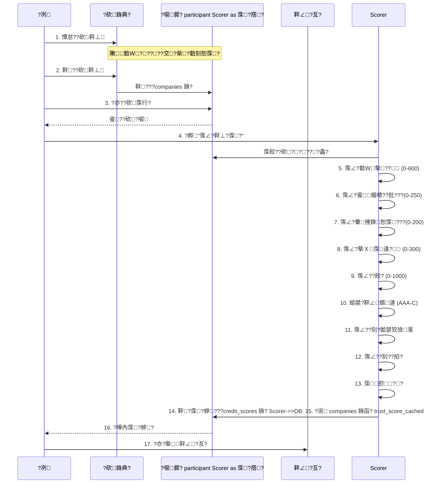

# ?砍?€?啗???蝟餅?格皞秩??
## 璁膩

DecoFinance ??啁? **4 蝏游漲靽⊥?霂?雿頂**嚗?026 撟?3 ??堆?嚗?????桀??亥?砍銵典?敶?霂湔??﹝霂衣?隞?鈭???蝟餌??唳?交????亥楝敺?霈∠??餉???
---

## 霂?雿頂璁?

| 蝏游漲 | ?? | ?€擃? | 霂??捆 |
|------|------|--------|---------|
| **韐Ｗ摰?** | 60% | 600 ??| 瘜典?韏?僑?乩?憸€??冽??€???€€箏??瘥?|
| **餈蝔喳???* | 25% | 250 ??| ??撟湧????★?格??撌乩犖??|
| **韏捶銝恕霂?* | 15% | 200 ??| ???餉扇???極蝔釣?€??拍?€SH 摰銝颱遙?SO 霈方? |
| **摰Ｘ霂遠** | - | 300 ??| 摰Ｘ霂?撟喳??潦€ecoFinance 銝餉?霂摯 |

**?餃??**嚗? - 1000 ?? 
**靽∠蝑漣**嚗AA (751-1000), AA (701-750), A (651-700), BBB (601-650), BB (551-600), B (501-550), C (0-500)

---

## ?唳?交?霂西圾

### 1儭 韐Ｗ摰? (Financial Strength) - ?€擃?600 ??
#### 霂???

| ?? | ?? | ?€擃? | ?唳?交?摮挾 | 敶雿蔭 |
|------|------|--------|------------|---------|
| 瘜典?韏 | 25% | 150 ??| `registered_capital` | ?砍銵典? ???箸靽⊥ |
| 撟渲銝? | 25% | 150 ??| `annual_revenue` | ?砍銵典? ???箸靽⊥ |
| 瘚瘥? | 25% | 150 ??| `current_assets` / `current_liabilities` | ?砍銵典? ??餈?揣??|
| ?圈?瘥? | 25% | 150 ??| `total_cash` / `total_liabilities` | ?砍銵典? ??餈?揣??|
| ?箏??瘥?| 25% | 150 ??| `total_liabilities` / `shareholders_equity` | ?砍銵典? ??餈?揣??|

#### 敶?亙

**頝臬?**嚗/companies/add` ??`/companies/<id>/edit`

**銵典?雿蔭**嚗洵 2 ?典? "餈?揣??

**摮挾霂湔?**嚗?
```
???€?€?€?€?€?€?€?€?€?€?€?€?€?€?€?€?€?€?€?€?€?€?€?€?€?€?€?€?€?€?€?€?€?€?€?€?€?€?€?€?€?€?€?€?€?€?€?€?€?€?€?€?€?€?€?€?€?€?€?€????餈?揣??                                                  ?????€?€?€?€?€?€?€?€?€?€?€?€?€?€?€?€?€?€?€?€?€?€?€?€?€?€?€?€?€?€?€?€?€?€?€?€?€?€?€?€?€?€?€?€?€?€?€?€?€?€?€?€?€?€?€?€?€?€?€?€??????瘚韏漣 (current_assets)                                 ????  - 霂湔?嚗?貊???臬??啁?韏漣?駁?                         ????  - ??嚗葛撣?(HKD)                                         ????  - 蝷箔?嚗?,000,000                                          ????                                                            ??????瘚韐€?(current_liabilities)                            ????  - 霂湔?嚗?貊???€?輯??€箏?駁?                         ????  - ??嚗葛撣?(HKD)                                         ????  - 蝷箔?嚗?,000,000                                          ????                                                            ???????圈??駁? (total_cash)                                     ????  - 霂湔?嚗?賊銵?甈曉??圈?蝑遠?拇€駁?                       ????  - ??嚗葛撣?(HKD)                                         ????  - 蝷箔?嚗?,500,000                                          ????                                                            ???????餉???(total_liabilities)                                ????  - 霂湔?嚗?豢??€箏?駁?嚗??祇???剜?嚗?                ????  - ??嚗葛撣?(HKD)                                         ????  - 蝷箔?嚗?,000,000                                          ????                                                            ???????∩??? (shareholders_equity)                            ????  - 霂湔?嚗?詨?韏漣嚗?鈭?- 韐€綽?                          ????  - ??嚗葛撣?(HKD)                                         ????  - 蝷箔?嚗?,000,000                                          ?????€?€?€?€?€?€?€?€?€?€?€?€?€?€?€?€?€?€?€?€?€?€?€?€?€?€?€?€?€?€?€?€?€?€?€?€?€?€?€?€?€?€?€?€?€?€?€?€?€?€?€?€?€?€?€?€?€?€?€?€??```

#### 霈∠??餉?

```python
# 1. 瘜典?韏霂?
if company.registered_capital >= 10,000,000:  score = 150
elif >= 5,000,000:  score = 120
elif >= 1,000,000:  score = 90
elif >= 500,000:    score = 60
else:               score = 30

# 2. 撟渲銝?霂?
if company.annual_revenue >= 50,000,000:  score = 150
elif >= 20,000,000:  score = 120
elif >= 10,000,000:  score = 90
elif >= 5,000,000:   score = 60
else:                score = 30

# 3. 瘚瘥?霂?
current_ratio = company.current_assets / company.current_liabilities
if current_ratio > 1.6:   score = 150
elif >= 1.1:              score = 100
else:                     score = 50

# 4. ?圈?瘥?霂?
cash_ratio = company.total_cash / company.total_liabilities
if cash_ratio > 1.6:      score = 150
elif >= 1.1:              score = 100
else:                     score = 50

# 5. ?箏??瘥???debt_to_equity = company.total_liabilities / company.shareholders_equity
if debt_to_equity < 1:    score = 150
elif <= 2:                score = 100
else:                     score = 50
```

---

### 2儭 餈蝔喳???(Operational Stability) - ?€擃?250 ??
#### 霂???

| ?? | ?? | ?€擃? | ?唳?交?摮挾 | 敶雿蔭 |
|------|------|--------|------------|---------|
| ??撟湧? | 40% | 100 ??| `established_date` | ?砍銵典? ???箸靽⊥ |
| 摰?憿寧??| 40% | 100 ??| `project_count_completed` | ?砍銵典? ??餈?揣??|
| ?極鈭箸 | 20% | 50 ??| `employee_count` | ?砍銵典? ??餈?揣??|

#### 敶?亙

**頝臬?**嚗/companies/add` ??`/companies/<id>/edit`

**銵典?雿蔭**嚗?- ???交?嚗洵 1 ?典? "?箸靽⊥"
- ?極鈭箸???★?格嚗洵 2 ?典? "餈?揣??

**摮挾霂湔?**嚗?
```
???€?€?€?€?€?€?€?€?€?€?€?€?€?€?€?€?€?€?€?€?€?€?€?€?€?€?€?€?€?€?€?€?€?€?€?€?€?€?€?€?€?€?€?€?€?€?€?€?€?€?€?€?€?€?€?€?€?€?€?€?????箸靽⊥                                                     ?????€?€?€?€?€?€?€?€?€?€?€?€?€?€?€?€?€?€?€?€?€?€?€?€?€?€?€?€?€?€?€?€?€?€?€?€?€?€?€?€?€?€?€?€?€?€?€?€?€?€?€?€?€?€?€?€?€?€?€?€?????????交? (established_date)                               ????  - 霂湔?嚗?豢釣??蝡??交?                                 ????  - ?澆?嚗YYY-MM-DD                                         ????  - 蝷箔?嚗?018-05-15                                         ?????€?€?€?€?€?€?€?€?€?€?€?€?€?€?€?€?€?€?€?€?€?€?€?€?€?€?€?€?€?€?€?€?€?€?€?€?€?€?€?€?€?€?€?€?€?€?€?€?€?€?€?€?€?€?€?€?€?€?€?€??
???€?€?€?€?€?€?€?€?€?€?€?€?€?€?€?€?€?€?€?€?€?€?€?€?€?€?€?€?€?€?€?€?€?€?€?€?€?€?€?€?€?€?€?€?€?€?€?€?€?€?€?€?€?€?€?€?€?€?€?€????餈?揣??                                                  ?????€?€?€?€?€?€?€?€?€?€?€?€?€?€?€?€?€?€?€?€?€?€?€?€?€?€?€?€?€?€?€?€?€?€?€?€?€?€?€?€?€?€?€?€?€?€?€?€?€?€?€?€?€?€?€?€?€?€?€?€???????極鈭箸 (employee_count)                                 ????  - 霂湔?嚗?詨??撌交€餅                                   ????  - ??嚗犖                                                 ????  - 蝷箔?嚗?5                                                 ????                                                            ??????摰?憿寧??(project_count_completed)                      ????  - 霂湔?嚗???5 撟游?摰??★?格€餅                          ????  - ??嚗葵                                                 ????  - 蝷箔?嚗?5                                                 ?????€?€?€?€?€?€?€?€?€?€?€?€?€?€?€?€?€?€?€?€?€?€?€?€?€?€?€?€?€?€?€?€?€?€?€?€?€?€?€?€?€?€?€?€?€?€?€?€?€?€?€?€?€?€?€?€?€?€?€?€??```

#### 霈∠??餉?

```python
# 1. ??撟湧?霂?
years = (today - established_date).days / 365
if years >= 10:    score = 100
elif >= 5:         score = 80
elif >= 3:         score = 60
elif >= 1:         score = 40
else:              score = 20

# 2. 摰?憿寧?啗???if company.project_count_completed >= 100:  score = 100
elif >= 50:                                score = 80
elif >= 20:                                score = 60
elif >= 10:                                score = 40
else:                                      score = 20

# 3. ?極鈭箸霂?
if company.employee_count >= 50:   score = 50
elif >= 20:                        score = 40
elif >= 10:                        score = 30
else:                              score = 20
```

---

### 3儭 韏捶銝恕霂?(Qualifications) - ?€擃?200 ??
#### 霂???

| ?? | ?? | ?€擃? | ?唳?交?摮挾 | 敶雿蔭 |
|------|------|--------|------------|---------|
| ???餉扇 | 25% | 50 ??| `business_registration` | ?砍銵典? ???箸靽⊥ |
| 撠?撌亦??踹遣?釣??| 25% | 50 ??| `minor_works_contractor_registration` + `minor_works_registration_verified` | ?砍銵典? ??????霂?|
| 靽?嗆€?| 25% | 50 ??| `insurance_documents_uploaded` + `insurance_verified` | ?砍銵典? ??????霂?|
| OSH 摰銝颱遙 | 25% | 50 ??| `osh_safety_officer_license` + `osh_safety_officer_verified` | ?砍銵典? ??????霂?|
| ISO 霈方? | ?? | 0-50 ??| `iso_certified` | ?砍銵典? ??餈?揣??|

#### 敶?亙

**頝臬?**嚗/companies/add` ??`/companies/<id>/edit`

**銵典?雿蔭**嚗洵 3 ?典? "????霂?

**摮挾霂湔?**嚗?
```
???€?€?€?€?€?€?€?€?€?€?€?€?€?€?€?€?€?€?€?€?€?€?€?€?€?€?€?€?€?€?€?€?€?€?€?€?€?€?€?€?€?€?€?€?€?€?€?€?€?€?€?€?€?€?€?€?€?€?€?€????????霂?                                                  ?????€?€?€?€?€?€?€?€?€?€?€?€?€?€?€?€?€?€?€?€?€?€?€?€?€?€?€?€?€?€?€?€?€?€?€?€?€?€?€?€?€?€?€?€?€?€?€?€?€?€?€?€?€?€?€?€?€?€?€?€??????撠?撌亦??踹遣?釣? (minor_works_contractor_registration)????  - 霂湔?嚗K Minor Works Contractor Registration Number     ????  - ?澆?嚗摮?摮?蝏?                                      ????  - 蝷箔?嚗W1234567                                          ????                                                            ??????撠?撌亦?瘜典?撉??嗆€?(minor_works_registration_verified)  ????  - 霂湔?嚗??極蝔釣??血歇撉?                             ????  - ?★嚗?摰⊥ / 撌脤?霂?/ 撌脫?蝏?                          ????                                                            ??????靽?辣銝? (insurance_documents_uploaded)               ????  - 霂湔?嚗??拇?隞嗆?血歇銝?                                 ????  - 蝐餃?嚗???                                             ????                                                            ??????靽撉??嗆€?(insurance_verified)                         ????  - 霂湔?嚗??拇?血歇撉?                                     ????  - ?★嚗?摰⊥ / 撌脤?霂?/ 撌脫?蝏?                          ????                                                            ??????OSH 摰銝颱遙?抒??(osh_safety_officer_license)           ????  - 霂湔?嚗?銝??典摨瑚蜓隞餌??抒?瑞?                         ????  - ?澆?嚗摮?摮?蝏?                                      ????  - 蝷箔?嚗SH-2024-12345                                     ????                                                            ??????OSH 摰銝颱遙撉??嗆€?(osh_safety_officer_verified)        ????  - 霂湔?嚗SH 摰銝颱遙?抒?臬撌脤?霂?                        ????  - ?★嚗?摰⊥ / 撌脤?霂?/ 撌脫?蝏?                          ????                                                            ??????ISO 霈方? (iso_certified)                                  ????  - 霂湔?嚗?豢?行???ISO 霈方?                              ????  - 蝐餃?嚗???                                             ????  - ??憿對??? ISO 霈方?憸? +50 ??                       ?????€?€?€?€?€?€?€?€?€?€?€?€?€?€?€?€?€?€?€?€?€?€?€?€?€?€?€?€?€?€?€?€?€?€?€?€?€?€?€?€?€?€?€?€?€?€?€?€?€?€?€?€?€?€?€?€?€?€?€?€??```

#### 霈∠??餉?

```python
# 1. ???餉扇霂?嚗?憿駁★嚗?if company.business_registration:  score = 50
else:                              score = 0

# 2. 撠?撌亦??踹遣?釣????敹◆憿對?
if minor_works_contractor_registration AND minor_works_registration_verified:
    score = 50
elif minor_works_contractor_registration:
    score = 25
else:
    score = 0

# 3. 靽?嗆€???敹◆憿對?
if insurance_documents_uploaded AND insurance_verified:
    score = 50
elif insurance_documents_uploaded:
    score = 25
else:
    score = 0

# 4. OSH 摰銝颱遙霂?嚗?憿駁★嚗?if osh_safety_officer_license AND osh_safety_officer_verified:
    score = 50
elif osh_safety_officer_license:
    score = 25
else:
    score = 0

# 5. ISO 霈方?霂?嚗??★嚗?if iso_certified:
    score = 50
else:
    score = 0
```

---

### 4儭 摰Ｘ霂遠 (Customer Reviews) - ?€擃?300 ??
#### 霂???

| 蝏辣 | ?? | ?€擃? | ?唳?交?摮挾 | ?嗆€?|
|------|------|--------|------------|------|
| 摰Ｘ霂?撟喳???| 50% | 150 ??| `average_rating` | ?? 敺???|
| DecoFinance 銝餉?霂摯 | 50% | 150 ??| 蝟餌??芸霈∠? | ??撌脣???|

#### 敶??嗆€?
?? **瘜冽?**嚗average_rating` 摮挾??Company 璅∪?銝?*撠摰?**嚗?閬?憿寧霂遠蝟餌?????
#### 敶?霂??餉?

```python
# 1. 摰Ｘ霂?撟喳??潘?暺恕?潘?
avg_rating = getattr(company, 'average_rating', None)
if avg_rating is not None:
    rating_score = 30 + (avg_rating - 1) * 30  # 1-5 ?笆摨?30-150 ??else:
    rating_score = 30  # 暺恕??
# 2. DecoFinance 銝餉?霂摯嚗鈭隞?畾萇?蝏澆?霂摯嚗?subjective_score = _subjective_assessment(company)  # 0-150 ??
# 摰Ｘ霂遠?餃?
customer_review_score = rating_score + subjective_score
```

#### 憸????寞?

```python
# ?芣摰嚗?閬★?株?隞瑞頂蝏??

# 1. 隞?ProjectReview 璅∪??瑕?撟喳?霂?
average_rating = db.session.query(
    func.avg(ProjectReview.rating)
).filter(
    ProjectReview.company_id == company.id
).scalar()

# 2. 霂???
if average_rating:
    rating_score = 30 + (average_rating - 1) * 30
    # 1.0 ????30 ??    # 3.0 ????90 ??    # 5.0 ????150 ??else:
    rating_score = 30  # 暺恕??```

---

## ?唳敶瘚?

### 甇仿炊 1嚗溶??蝻??砍

**霈輸頝臬?**嚗?- ?啣??砍嚗/companies/add`
- 蝻??砍嚗/companies/<id>/edit`

**銵典?蝏?**嚗?
```
???€?€?€?€?€?€?€?€?€?€?€?€?€?€?€?€?€?€?€?€?€?€?€?€?€?€?€?€?€?€?€?€?€?€?€?€?€?€?€?€?€?€?€?€?€?€?€?€?€?€?€?€?€?€?€?€?€?€?€?€?????砍瘜典? / 蝻?                                              ?????€?€?€?€?€?€?€?€?€?€?€?€?€?€?€?€?€?€?€?€?€?€?€?€?€?€?€?€?€?€?€?€?€?€?€?€?€?€?€?€?€?€?€?€?€?€?€?€?€?€?€?€?€?€?€?€?€?€?€?€????1. ?箸靽⊥                                                  ????  ?? ?砍?妍???蝘?                                      ????  ?? ???餉扇??                                              ????  ?? ???交?                                                 ????  ?? ?頂鈭箔縑??                                              ????  ?? ?啣????                                              ????  ?? 瘜典?韏                                                 ????  ?? 撟渲銝?                                                 ????                                                            ????2. 餈?揣??                                               ????  ?? ?極鈭箸                                                 ????  ?? 摰?憿寧??                                              ????  ?? 撟喳?憿寧??                                             ????  ?? ?嗉?韐行撟湧?                                             ????  ?? ?唳?韐瑟狡                                                 ????  ?? 餈狡霈啣?                                                 ????  ?? ???                                                 ????  ?? ISO 霈方?                                                 ????  ?? 瘚韏漣???刻??箝€?€駁?蝑??啣?嚗?                 ????                                                            ????3. ????霂?                                               ????  ?? ?靽⊥嚗掩?€?€掩?怒€?嚗?                   ????  ?? 靽靽⊥嚗??拙?詻€????嚗?                   ????  ?? 撠?撌亦??踹遣?釣?嚗憓?                            ????  ?? OSH 摰銝颱遙?抒?瘀??啣?嚗?                             ????  ?? 銝?隡?韏                                             ????                                                            ????4. ??摰?亙熒??ESG 蝞⊥                                   ????  ?? OSH ?輻?                                                 ????  ?? 摰?寡悌閬???                                          ????  ?? 16kg ?祈?蝞⊥                                            ????  ?? 韏琿?霈曉?                                                 ????  ?? 摰鈭???                                              ????  ?? ESG ?輻?蝥批                                             ????  ?? 蝏輯??雿輻??                                          ?????€?€?€?€?€?€?€?€?€?€?€?€?€?€?€?€?€?€?€?€?€?€?€?€?€?€?€?€?€?€?€?€?€?€?€?€?€?€?€?€?€?€?€?€?€?€?€?€?€?€?€?€?€?€?€?€?€?€?€?€??```

### 甇仿炊 2嚗恣蝞???
**霈輸頝臬?**嚗?- ?砍霂行?憿菟 ??"靽⊥?霂?" ?∠? ??"霈∠?靽⊥?霂?" ?
- 頝舐嚗POST /companies/<id>/calculate_score`

**?亙雿蔭**嚗?
```
???€?€?€?€?€?€?€?€?€?€?€?€?€?€?€?€?€?€?€?€?€?€?€?€?€?€?€?€?€?€?€?€?€?€?€?€?€?€?€?€?€?€?€?€?€?€?€?€?€?€?€?€?€?€?€?€?€?€?€?€?????砍霂行?憿????喃儒颲寞?                                        ?????€?€?€?€?€?€?€?€?€?€?€?€?€?€?€?€?€?€?€?€?€?€?€?€?€?€?€?€?€?€?€?€?€?€?€?€?€?€?€?€?€?€?€?€?€?€?€?€?€?€?€?€?€?€?€?€?€?€?€?€???????€?€?€?€?€?€?€?€?€?€?€?€?€?€?€?€?€?€?€?€?€?€?€?€?€?€?€?€?€?€?€?€?€?€?€?€?€?€?€?€?€?€?€?€?€?€?€?€?€?€?€?€?€?€?€?€????????靽⊥?霂?                                                 ?????????€?€?€?€?€?€?€?€?€?€?€?€?€?€?€?€?€?€?€?€?€?€?€?€?€?€?€?€?€?€?€?€?€?€?€?€?€?€?€?€?€?€?€?€?€?€?€?€?€?€?€?€?€?€?€?€????????靽∠霂?嚗?468                                           ????????靽∠蝑漣嚗                                              ????????                                                        ????????憌蝑漣嚗葉蝑?                                          ????????撱箄悅憸漲嚗K$ 2,000,000                                  ?????????拍?嚗?.5%                                               ?????????€?€?€?€?€?€?€?€?€?€?€?€?€?€?€?€?€?€?€?€?€?€?€?€?€?€?€?€?€?€?€?€?€?€?€?€?€?€?€?€?€?€?€?€?€?€?€?€?€?€?€?€?€?€?€?€????????[霈∠?靽⊥?霂?] ???孵甇斗???                             ?????????€?€?€?€?€?€?€?€?€?€?€?€?€?€?€?€?€?€?€?€?€?€?€?€?€?€?€?€?€?€?€?€?€?€?€?€?€?€?€?€?€?€?€?€?€?€?€?€?€?€?€?€?€?€?€?€???????€?€?€?€?€?€?€?€?€?€?€?€?€?€?€?€?€?€?€?€?€?€?€?€?€?€?€?€?€?€?€?€?€?€?€?€?€?€?€?€?€?€?€?€?€?€?€?€?€?€?€?€?€?€?€?€?€?€?€?€??```

---

## 霂?霈∠?瘚?



---

## ?唳摮挾皜?

### ?砍銵其葉?€????喳?畾?
```python
# ?箸靽⊥
registered_capital              # 瘜典?韏 (float)
annual_revenue                  # 撟渲銝? (float)
established_date                # ???交? (date)

# 餈?揣??employee_count                  # ?極鈭箸 (int)
project_count_completed         # 摰?憿寧??(int)
current_assets                  # 瘚韏漣 (float) 潃??啣?
current_liabilities             # 瘚韐€?(float) 潃??啣?
total_cash                      # ?圈??駁? (float) 潃??啣?
total_liabilities               # ?餉???(float) 潃??啣?
shareholders_equity             # ?∩??? (float) 潃??啣?

# ????霂?business_registration           # ???餉扇 (string)
minor_works_contractor_registration  # 撠?撌亦??踹遣?釣? 潃??啣?
minor_works_registration_verified    # 撠?撌亦?瘜典?撉??嗆€?潃??啣?
insurance_documents_uploaded    # 靽?辣銝? 潃??啣?
insurance_verified              # 靽撉??嗆€?潃??啣?
osh_safety_officer_license      # OSH 摰銝颱遙?抒??潃??啣?
osh_safety_officer_verified     # OSH 摰銝颱遙撉??嗆€?潃??啣?
iso_certified                   # ISO 霈方? (boolean)

# ??摰?亙熒??ESG 蝞⊥
safety_training_coverage        # 摰?寡悌閬???(int, %)
heavy_lifting_compliance        # 16kg ?祈?蝞⊥ (boolean)
lifting_equipment_available     # 韏琿?霈曉??舐 (boolean)
safety_incident_count           # 摰鈭???(int)
esg_policy_level                # ESG ?輻?蝥批 (string)
green_material_ratio            # 蝏輯??雿輻??(int, %)

# 摰Ｘ霂遠 ?? 敺???average_rating                  # 摰Ｘ霂?撟喳????? 蝻箏仃
```

---

## 敶?亙?餌?

| 霂?蝏游漲 | 敶憿菟 | 頝臬? | 敹‵摮挾 |
|---------|---------|------|---------|
| **韐Ｗ摰?** | ?砍銵典? | `/companies/add` ??"餈?揣?? | 瘚韏漣???刻??箝€?€駁??€餉??箝€銝???|
| **餈蝔喳???* | ?砍銵典? | `/companies/add` ??"?箸靽⊥" + "餈?揣?? | ???交???撌乩犖?啜€??★?格 |
| **韏捶銝恕霂?* | ?砍銵典? | `/companies/add` ??"????霂? | ???餉扇???極蝔釣?€??拍?€SH 摰銝颱遙 |
| **摰Ｘ霂遠** | ?? 敺???| ?€閬★?株?隞瑞頂蝏???| `average_rating` 摮挾 |

---

## 霂?霈∠??亙

**?砍霂行?憿菟** ??"靽⊥?霂?" ?∠? ??**"霈∠?靽⊥?霂?" ?**

- ?望??嚗/companies/<id>` ??"Calculate Trust Score" ?
- 銝剜??嚗/companies/<id>` ??"霈∠?靽⊥?霂?" ?

**頝舐**嚗POST /companies/<id>/calculate_score`

**??閬?**嚗?- `admin` - ?臭誑霈∠?隞颱??砍????- `reviewer` - ?臭誑霈∠?隞颱??砍????- `company_user` - ?臭誑霈∠??芸楛?砍????- `customer` - ?臭誑霈∠??唾??砍????
---

## 瘜冽?鈭★

### ?? ???內

1. **摰Ｘ霂遠摮挾蝻箏仃**
   - `average_rating` 摮挾撠??Company 璅∪?銝剖?銋?   - 敶?雿輻暺恕??30 ??   - ?€閬?憿寧霂遠蝟餌???

2. **?唳摰??*
   - 蝖桐??刻恣蝞???嚗???閬?韐Ｗ??韐冽?桅撌脣???   - 蝻箏仃?喲摮挾隡紡?渲????＆

3. **?閫血?**
   - 霂??€閬??函??霈∠?靽⊥?霂?"?
   - 銝??芸霈∠?

4. **霂?蝻?**
   - 霂?蝏?靽???`credit_scores` 銵?   - ?砍銵其葉??`trust_score_cached` 摮挾摮?€?啗???
5. **憭活霂?**
   - ?臭誑憭活霈∠?霂?嚗?甈⊿隡?????扇敶?   - 霂??靽???`credit_scores` 銵?
---

## 蝷箔??唳

### 蝷箔? 1嚗?韐典?賂?AAA 蝥改?

```
?砍?妍嚗uildPro Renovation Ltd.
瘜典?韏嚗?5,000,000 HKD
撟渲銝?嚗?0,000,000 HKD
???交?嚗?010-01-15
?極鈭箸嚗?0
摰?憿寧?堆?150
瘚韏漣嚗?0,000,000
瘚韐€綽?8,000,000
?圈??駁?嚗?2,000,000
?餉??綽?10,000,000
?∩???嚗?5,000,000
撠?撌亦?瘜典?嚗歇撉?
靽?嗆€?撌脤?霂?OSH 摰銝颱遙嚗歇撉?
ISO 霈方?嚗

霂?蝏?嚗?- 韐Ｗ摰?嚗?00/600
- 餈蝔喳??改?250/250
- 韏捶銝恕霂?200/200
- 摰Ｘ霂遠嚗?80/300
?€?€?€?€?€?€?€?€?€?€?€?€?€?€?€?€?€?€?€?€?€
- ?餃?嚗?330/1000 ( capped )
- 靽∠蝑漣嚗AA
- ?刻?憸漲嚗K$ 50,000,000
- ?刻??拍?嚗?.5%
```

### 蝷箔? 2嚗???砍嚗 蝥改?

```
?砍?妍嚗tartRenov Co.
瘜典?韏嚗?00,000 HKD
撟渲銝?嚗?,000,000 HKD
???交?嚗?024-06-01
?極鈭箸嚗?
摰?憿寧?堆?3
瘚韏漣嚗?00,000
瘚韐€綽?600,000
?圈??駁?嚗?00,000
?餉??綽?1,000,000
?∩???嚗?00,000
撠?撌亦?瘜典?嚗瘜典?
靽?嗆€?敺?霂?OSH 摰銝颱遙嚗?蔭
ISO 霈方?嚗

霂?蝏?嚗?- 韐Ｗ摰?嚗?00/600
- 餈蝔喳??改?80/250
- 韏捶銝恕霂?50/200
- 摰Ｘ霂遠嚗?0/300
?€?€?€?€?€?€?€?€?€?€?€?€?€?€?€?€?€?€?€?€?€
- ?餃?嚗?60/1000
- 靽∠蝑漣嚗
- ?刻?憸漲嚗K$ 72,000
- ?刻??拍?嚗?0.0%
```

---

## ?€?臬???
### 霂?撘?

**?辣雿蔭**嚗services/credit_scorer.py`

**?詨?蝐?*嚗CreditScorer`

**銝餉??寞?**嚗?- `calculate_score(company)` - 霈∠?霂?
- `_score_financial_strength(company)` - 韐Ｗ摰?霂?
- `_score_operational_stability(company)` - 餈蝔喳??扯???- `_score_qualifications(company)` - 韏捶銝恕霂???- `_score_customer_reviews(company)` - 摰Ｘ霂遠霂?
- `save_score(company, result)` - 靽?霂?蝏?

### 頝舐摰

**?辣雿蔭**嚗routes/companies.py`

**頝舐**嚗?- `POST /companies/<id>/calculate_score` - 霈∠?霂?

**閫?賣**嚗?- `calculate_score(id)` - 霂?霈∠?閫

---

## ?賒?寡?

### 敺??啣???
1. **摰Ｘ霂遠蝟餌???**
   - 瘛餃? `average_rating` 摮挾??Company 璅∪?
   - 隞?ProjectReview 璅∪??瑕?撟喳?霂?
   - 摰摰Ｘ霂遠??冽??
2. **霂??芸閫血?**
   - ?砍靽⊥?湔?嗉?券??啗恣蝞???   - 摰??寥??湔?€??貉???
3. **霂???航???*
   - 霂?頞?曇”
   - 霂?????

4. **霂?璅⊥???*
   - 鈭支?撘??芋?
   - "憒?-???" ??

---

## ?頂?孵?

憒??嚗窈?頂?€?臬??
- ?€?舀?獢?輕?歹?DecoFinance Development Team
- ?€??堆?2026 撟?3 ??24 ??- ?嚗2.0 (??4 蝏游漲霂?雿頂)

